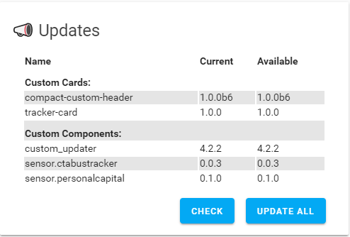
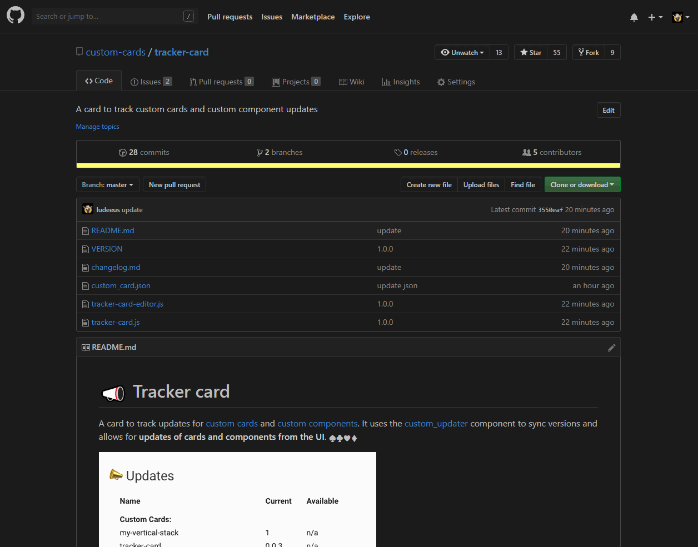

# 📣 Tracker card

A card to track updates for [custom cards](https://github.com/custom-cards) and [custom components](https://github.com/custom-components). It uses the [custom_updater](https://github.com/custom-components/custom_updater) component to sync versions and allows for **updates of cards and components from the UI**. ♠️♣️♥️♦️



## Options

| Name | Type | Default | Description
| ---- | ---- | ------- | -----------
| type | string | **Required** | `custom:tracker-card`
| trackers | list | ['`sensor.custom_card_tracker`', '`sensor.custom_component_tracker`'] | A list sensors to use for tracking, `sensor.custom_card_tracker` and/or `sensor.custom_component_tracker`
| title | string | 📣 Updates | Name to display on card
| name_text | string | Name | translation for Name
| current_text | string | Current | translation for Current
| available_text | string | Available | translation for Available
| check_text | string | Check | translation for Check
| update_all_text | string | Update All | translation for Update All

## Installation and tracking with `custom_updater`

_Before you install this you need to complete the installation steps for [custom_updater](https://github.com/custom-components/custom_updater)_

1. Configure Lovelace to load the card:.

```yaml
resources:
  - url: /customcards/github/custom-cards/tracker-card.js?track=true
    type: module
```

2. Run the service `custom_updater.check_all` or restart Home Assistant.
3. Refresh the front end.

4. Add this in your Lovelace configuration.

```yaml
type: custom:tracker-card
```

__[Tracking of cards must be enabled before you can do this.](https://github.com/custom-components/custom_updater/wiki/Installation#configuration-option-track)._

### Installation demo



## Credits

- [ciotlosm](https://github.com/ciotlosm)
- [ludeeus](https://github.com/ludeeus)
